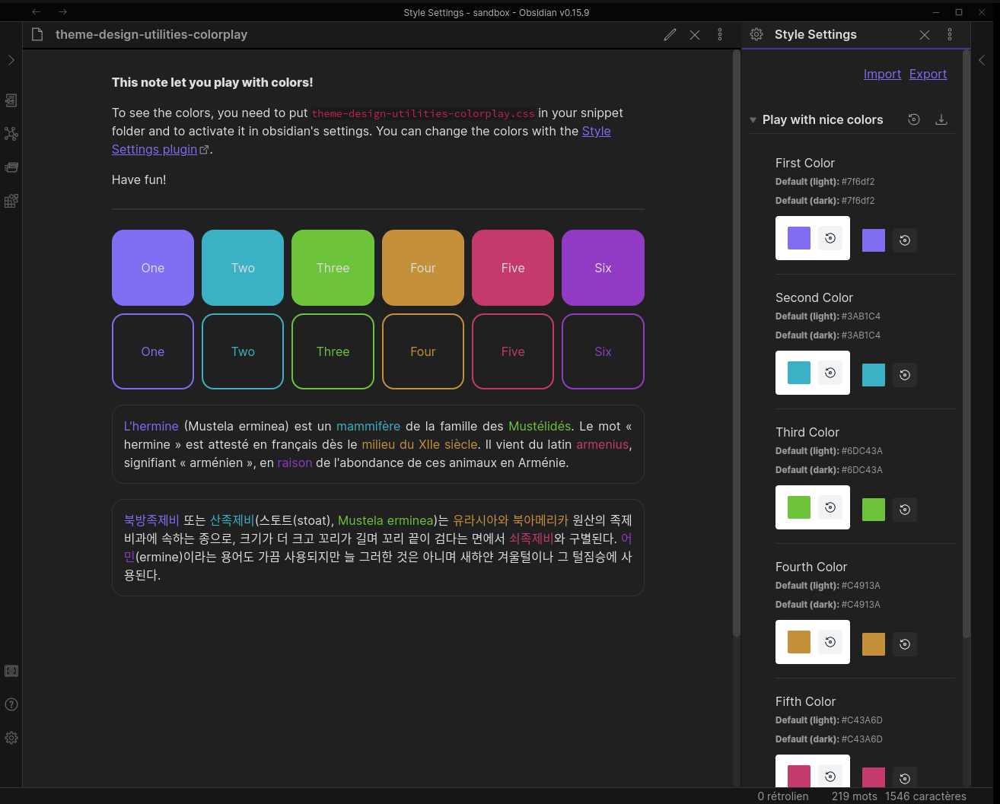

# Theme Design Utilities

  [](Changelog.md)

Some utilities and Quality-of-Life features for designers of [Obsidian](https://obsidian.md/) themes.

## Table of Content
<!--toc:start-->
  - [Commands Added](#commands-added)
    - [Mobile Emulation](#mobile-emulation)
    - [Cycle between All Three Modes](#cycle-between-all-three-modes)
    - [Cycle through Installed Themes](#cycle-through-installed-themes)
    - [Light/Dark Mode Toggle](#lightdark-mode-toggle)
    - [Freeze Obsidian](#freeze-obsidian)
    - [Red Outlines for Debugging](#red-outlines-for-debugging)
    - [Permanent Test Notice](#permanent-test-notice)
    - [CSS Feature Compatibility (Chrome Version)](#css-feature-compatibility-chrome-version)
    - [Cheatsheet](#cheatsheet)
  - [Documentation and sample notes](#documentation-and-sample-notes)
    - [Cheatsheets](#cheatsheets)
    - [Markdown note: display your current theme colors](#markdown-note-display-your-current-theme-colors)
    - [Markdown note and CSS snippet: play with colors](#markdown-note-and-css-snippet-play-with-colors)
  - [Other Resources for Obsidian Theme Designers](#other-resources-for-obsidian-theme-designers)
    - [Obsidian Plugins](#obsidian-plugins)
    - [Guides](#guides)
  - [Installation](#installation)
  - [Contribute](#contribute)
  - [About the Developer](#about-the-developer)
    - [Profiles](#profiles)
    - [Donate](#donate)
<!--toc:end-->


## Commands Added

### Mobile Emulation
Conveniently enable the mobile emulation of Obsidian, i.e. how Obsidian would look on mobile. This helps with styling your theme for mobile.

### Cycle between All Three Modes
Cycles between Source Mode, Live Preview, and Reading Mode. Set a hotkey to quickly check how the theme looks in all three view modes.

### Cycle through Installed Themes
Cycles between all installed themes. As opposed to the Theme Switcher Plugin, this does not open a modal, but rather directly switches to the next installed theme.


### Light/Dark Mode Toggle
A simple command to toggle between light and dark mode. Set a hotkey to quickly change the mode of the theme.


### Freeze Obsidian
Freeze interaction with Obsidian, after a small delay. During that delay, you can create fleeting elements like context menus or tooltips which will stay on screen. (Note that this only works while the console is open.) To unfreeze Obsidian, simply click the "play" button which appears at the top of Obsidian.


### Garble Text
Garbles all text in the whole app. Ungarbles elements that are hovered. This way you can share screenshots while maintaining privacy. 

### `.foobar` Test Class
This command adds/removes a test class `.foobar` to the DOM-element `.app-container`. This way you can quickly toggle some CSS on-and-off for debugging purposes, without having to enable/disable a snippet.

```css
.app-container.foobar h1 {
	color: red;
}
```

### Red Outlines for Debugging
Add red outlines to all elements. Run the command again to remove the outlines. THe outlines are useful for debugging purposes, [essentially serving as the CSS equivalent for `console.log()`](https://www.youtube.com/shorts/ii-lSK2_Nu4).

### Permanent Test Notice
Post a notice (notification) that stays on screen until you click it. This is useful for styling notices, as they normally quickly fade away.


### CSS Feature Compatibility (Chrome Version)
- Will display a notice with the current Chrome version utilized by Obsidian to render CSS. Sites like [MDN](https://developer.mozilla.org/en-US/) or [W3-Schools](https://www.w3schools.com/cssref/css3_pr_overflow-y.asp) usually document the minimum Chrome version required for a certain CSS feature at the bottom of the feature's documentation page.
- On iOS, Obsidian uses the Safari engine, for which the version matches the iOS version the user is using. Prevalence of iOS versions – and therefore underlying Safari versions to target – [are published by Apple itself](https://developer.apple.com/support/app-store/).

If you are using [stylelint](https://stylelint.io/), you can also simply use the nifty [stylelint-no-unsupported-browser-features plugin](https://www.npmjs.com/package/stylelint-no-unsupported-browser-features), and add this to your `.stylelintrc.json`:

```json
{
	"extends": ["stylelint-config-recommended"],
	"plugins": ["stylelint-no-unsupported-browser-features"],
	"rules": [
		"plugin/no-unsupported-browser-features": [true, {
			"browsers": ["last 10 Chrome versions", "last 3 iOS versions"],
			"ignore": ["css-masks"],
			"ignorePartialSupport": true
		}],
	]
}
```

### Cheatsheet
Open a cheat sheet showing the Obsidian CSS classes.


## Documentation and sample notes
You can access these resources without installing the plugin.

### Cheatsheets
You can get various obsidian design cheatsheets from the [cheatsheets folder](https://github.com/chrisgrieser/obsidian-theme-design-utilities/tree/main/cheatsheets).

### Markdown note: display your current theme colors
The [theme-design-utilities-current_theme.md](https://github.com/chrisgrieser/obsidian-theme-design-utilities/tree/main/color-playground/theme-design-utilities-current_theme.md) mardown note can be added to your vault to display your current theme colors.


### Markdown note and CSS snippet: play with colors
The [theme-design-utilities-colorplay.md](https://github.com/chrisgrieser/obsidian-theme-design-utilities/tree/main/color-playground/theme-design-utilities-colorplay.md) mardown note and its [companion CSS snippet](https://github.com/chrisgrieser/obsidian-theme-design-utilities/tree/main/color-playground/theme-design-utilities-colorplay.md) display colored boxes. The note should be added to your vault, and the CSS snippet to your snippet collection. You can change the colors by edditing the CSS snippet, or using the [Style Settings plugin](https://github.com/mgmeyers/obsidian-style-settings).



## Other Resources for Obsidian Theme Designers

### Obsidian Plugins
- [My Snippets](https://github.com/chetachiezikeuzor/MySnippets-Plugin)
- [Snippet Commands](https://github.com/deathau/snippet-commands-obsidian)
- [Theme Picker](https://github.com/kenset/obsidian-theme-picker)
- [Print Preview](https://github.com/nothingislost/obsidian-print-preview) (unlisted)

### Guides
- [Overview of Resources and Guides for Theme Designers](https://publish.obsidian.md/hub/04+-+Guides%2C+Workflows%2C+%26+Courses/Guides/Resources+and+Guides+for+Theme+Designers)
- [Why and How to use Stylelint for your Obsidian Theme](https://publish.obsidian.md/hub/04+-+Guides%2C+Workflows%2C+%26+Courses/Guides/Why+and+How+to+use+Stylelint+for+your+Obsidian+Theme)
- [Want some Sass with your obsidian theme? Here's How and Why](https://publish.obsidian.md/hub/04+-+Guides%2C+Workflows%2C+%26+Courses/Guides/Want+some+Sass+with+your+obsidian+theme%E2%80%BD+here's+How+and+Why)
- [How to Use Obsidian 0.16 CSS Variables](https://publish.obsidian.md/hub/04+-+Guides%2C+Workflows%2C+%26+Courses/Guides/Want+some+Sass+with+your+obsidian+theme%E2%80%BD+here's+How+and+Why)

## Installation
This plugin is available in Obsidian's Community Plugin Browser: `Settings` → `Community Plugins` → `Browse` → Search for *"Theme Design Utilities"*

## Contribute
Pull Requests adding more utilities are very welcome!

Please use the `.eslintrc` configuration located in the repository and run eslint before doing a pull request, though. 🙂

```shell
# Run eslint fixing most common mistakes
eslint --fix *.ts
```

## About the Developer
In my day job, I am a sociologist studying the social mechanisms underlying the digital economy. For my PhD project, I investigate the governance of the app economy and how software ecosystems manage the tension between innovation and compatibility. If you are interested in this subject, feel free to get in touch!

<!-- markdown-link-check-disable -->
### Profiles
- [Academic Website](https://chris-grieser.de/)
- [ResearchGate](https://www.researchgate.net/profile/Christopher-Grieser)
- [Discord](https://discordapp.com/users/462774483044794368/)
- [GitHub](https://github.com/chrisgrieser/)
- [Twitter](https://twitter.com/pseudo_meta)
- [LinkedIn](https://www.linkedin.com/in/christopher-grieser-ba693b17a/)

### Donate
<a href='https://ko-fi.com/Y8Y86SQ91' target='_blank'></a>

If you feel very generous, you may also buy me something from my Amazon wish list. But please donate something to developers who still go to college, before you consider buying me an item from my wish list! 😊

[Amazon wish list](https://www.amazon.de/hz/wishlist/ls/2C7RIOJPN3K5F?ref_=wl_share)
